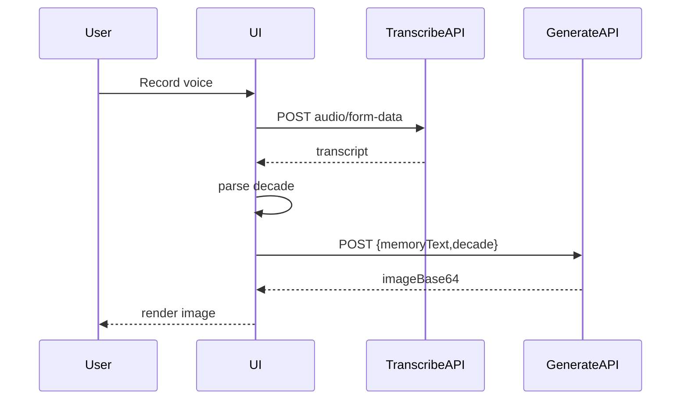

# Voice Memory Image — Plan

## Phase 1 — Context (done)

- btca: AI SDK OpenRouter OpenAI-compatible provider; Whisper turbo CLI usage
- MCP Svelte: SvelteKit `+server` endpoints, JSON/form handling, server-only modules, private envs, Vercel adapter unchanged

## Phase 2 — Build Plan

### Architecture & Data Flow

### Tasks

1) Dependencies + env template

- Add `@ai-sdk/openai-compatible` (AI SDK already present) via pnpm
- Create `.env.example` with:
  - `OPENROUTER_API_KEY=...`
  - `OPENROUTER_BASE_URL=https://openrouter.ai/api/v1`
  - `OPENROUTER_REFERRER=`
  - `OPENROUTER_TITLE=`
  - `WHISPER_MODEL=turbo`
  - `WHISPER_LANGUAGE=de`
  - `WHISPER_BIN=whisper`

2) Server-only provider setup

- Add server-only helper, e.g. [`src/lib/server/openrouter.ts`](src/lib/server/openrouter.ts): create provider with `createOpenAICompatible`, image model `bytedance-seed/seedream-4.5`
- Use `$env/static/private` or `$env/dynamic/private` for keys

3) Transcription endpoint (local Whisper)

- Add [`src/routes/api/transcribe/+server.ts`](src/routes/api/transcribe/+server.ts)
- Accept `multipart/form-data` with audio blob
- Save temp file, run `whisper <file> --model turbo --language de`, parse transcript
- Wrap errors via `neverthrow` and return JSON `{ text }`

4) Image generation endpoint

- Add [`src/routes/api/generate/+server.ts`](src/routes/api/generate/+server.ts)
- Accept JSON `{ memoryText, decade }`
- Build prompt: memory + decade style constraints
- Call `generateImage` with Seedream model via OpenRouter
- Return JSON `{ imageBase64 }`

5) Decade parsing

- Add helper in [`src/lib/decade.ts`](src/lib/decade.ts):
  - Parse `1940–2000`, `1940er`, `40er`, optional German words
  - Validate supported range; return `Result<Decade,Error>`

6) UI (minimal, 2-column)

- Update [`src/routes/+page.svelte`](src/routes/+page.svelte)
- Left: title + record button + status text
- Right: image container + placeholder
- Beige background + coffee-brown text via Tailwind v4
- Use Svelte 5 runes (`$state`) for status, transcript, image

7) Wiring flow

- Client flow: record → `/api/transcribe` → parse decade → `/api/generate` → render image
- Show loading/error states; disable button while running

8) Sanity checks (optional)

- `pnpm check` and `pnpm lint` after edits

### Files to touch

- [`src/routes/+page.svelte`](src/routes/+page.svelte)
- [`src/routes/api/transcribe/+server.ts`](src/routes/api/transcribe/+server.ts)
- [`src/routes/api/generate/+server.ts`](src/routes/api/generate/+server.ts)
- [`src/lib/server/openrouter.ts`](src/lib/server/openrouter.ts)
- [`src/lib/decade.ts`](src/lib/decade.ts)
- [`.env.example`](.env.example)

### Notes / Constraints

- Local-only app (no Vercel runtime for Whisper)
- Keep adapter as Vercel; do not switch
- Use TypeScript everywhere, Svelte 5 syntax, Tailwind v4
- Error handling via `neverthrow` in server code